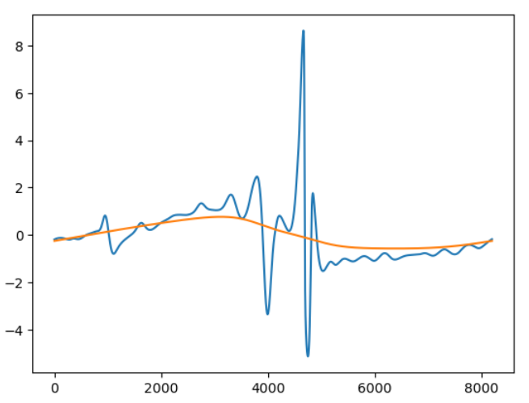

# 7-2-2023

First experimental log 1 month into the project 🥳.

Currently playing Li et al.'s data to check if the current model trained with simulated data, can generate accurate predictions.

From the looks of it, it's not going too well 😔. Even when you change the step-size.

Time to read the paper on physics-informed neural operators I guess.