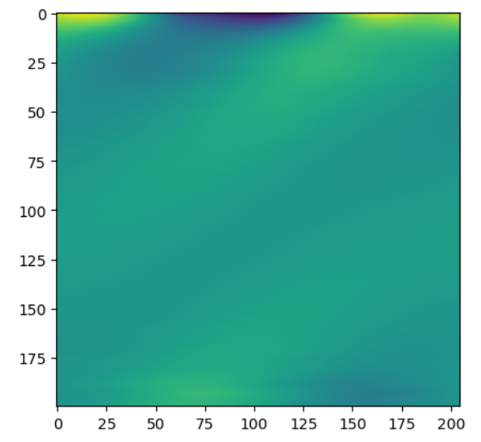

# 3-7-2023

Ah, the sweet smell of success! With much effort and skill, I have re-written the code to map u(x, 0) to u(x, t) for all t up to 1s.

The artifacts at the bottom are a consequence of me not implementing the physics loss properly so its forced to be periodic in the time dimension 😆. 

Also, I figured out a much better way to handle the BCs. We make the model map from whatever parameters to the interior 
of the object and determine the BCs implicitly, based on the outputs of the model! Alot simpler than what the BOON paper tries to do.

Going to have to find a nice way to write some general code for this though.

There's also something wrong with the factorised neural operator, need to figure that out too.